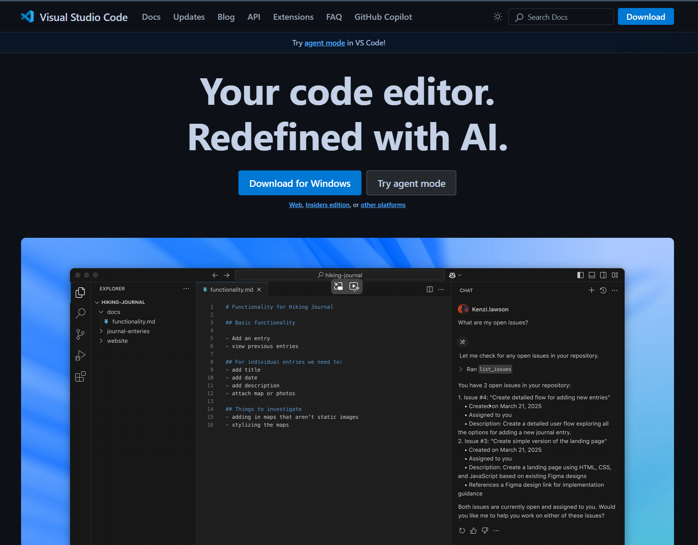
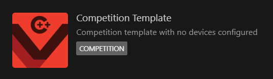

# Programming - 编程
***

#### :warning:在开始前你需要知道的:warning:
这一部分**不是纯粹的编程教程**，会默认读者已经了解很多基础知识，因此对于从未接触过编程的，或是仅仅只靠学校课程学习的朋友来说，可能理解起来会有难度，我强烈建议先从网上找教程或其他途径，认真学习一下编程的语法基础，编程思维等，而不是现在立刻开始阅读这一部分。

#### **目录**
- [开发平台](#开发平台)
- [创建新项目](#创建新项目)
- [认识项目文件](#认识项目文件)
- [C++编写规范](#C++编写规范)
- [VEX API食用指南](#vex-api食用指南)
***

## 开发平台
这里使用的VEX机器人程序的开发软件为 **Visual Studio Code**（vscode）和 **VEX官方扩展** ，语言为 **C++** ，当然也有其他开发选择（例如PROS扩展，官方的VEX CODE PRO V5），但是技巧是通用的，这里只使用这种方式做演示。
- [Visual Studio Code](https://code.visualstudio.com/)

    （使用vscode的好处就是有AI代码补全功能，有时候会省事不少）
- VEX官方扩展

    :high_brightness:建议VEX官方扩展安装 **0.6.0版本** ，因为后续版本貌似终端打印功能失效了，这不利于读取遥测数据和分析机器人状态。
    :high_brightness:第一次直接安装0.6.0可能会失败，这个时候可以先装最新的版本，然后卸载重装0.6.0或是直接退回0.6.0版本。
***

## 创建新项目
假设你已经配置好了开发环境，那么可以开始这一部分。
步骤如下：
- 打开vscode，点击左边栏的vex扩展
- 选择new project
- 选择V5
- 选择C/C++
- 选择图示模板
  
- 给你的项目命名，并选择储存路径
  :warning:这里需要注意的是，命名只能用英文字母，下划线_，短横杠-，加减号+-，也不能带空格，否则机器人主控读取不到名称。储存路径最好也不要带有中文，否则可能会出现意外的bug，而且强烈建议新建一个文件夹专门存放你所有的项目，因为默认给的路径实在太阴间
***

## 认识项目文件
这一部分帮助你认识一个项目包含哪些文件，以及这些文件有什么作用。准确来说，这一部分及其重要，因为后续的项目文件结构，都会基于这个基础来进行。这里只帮助你认识它们，具体怎么开始编程，会在下一部分介绍。
:high_brightness:建议在开始前把所有文件里面的所有注释都删除掉，这样结构更加清晰。

1. **robot-config.h**
   ```c++
    using namespace vex;

    extern brain Brain;

    void vexcodeInit(void); 
   ```
   这个文件是机器人配置文件之一，主要是 **声明** 机器人的所有电气元件，以及一些全局常量可以放在这里。此外，还包含一个初始化函数，这个后面会提及。

2. **vex.h**
   ```c++
    #include <math.h>
    #include <stdio.h>
    #include <stdlib.h>
    #include <string.h>

    #include "v5.h"
    #include "v5_vcs.h"

    #include "robot-config.h"
    ```
    上面这段代码包含VEX API，也就是编程时会用到的函数都会在里面，不需要做修改，这里不过多介绍。


    ```c++
    #define waitUntil(condition)
        do {                                                            \
            wait(5, msec);                                              \
        } while (!(condition))                                          \
    #define repeat(iterations)
        for (int iterator = 0; iterator < iterations; iterator++)       \
   ```
   上面这段代码是官方提供的小工具，可以理解为和if，while一样的控制语句。第一个 `waitUntil(condition)` 表示 **持续等待直到某条件达成** ，这个方法可以阻塞程序进行，避免错过某条件的达成就继续进行下去。 `repeat(iterations)` 表示 **重复执行某行为** ，这个类似于for循环，实现方式也是for循环，这个方法可以理解为帮你省去了for循环繁琐的语法，而你只需要关注重复的内容，以及重复几次。

3. **main.cpp**
   这是所有代码最终执行的地方，也就是main函数所在文件。
   下面说说这个文件的代码结构：
   - **pre_auto函数**
    ```c++
    void pre_auton(void) {
        vexcodeInit();
    }
    ```
    这个函数是最先执行的函数，几乎是程序一启动就会开始执行，因此你可以在这里进行机器人系统的初始化，包括但不限于：惯导的校准，编码器的置零，算法的初始化。
   - **autonomous函数**
    ```c++
    void autonomous(void) {
  
    }
    ```
    这个函数是自动时段函数，比赛的自动时段会执行这个函数，在这里面编写你的自动程序。
   - **usercontrol函数**
    ```c++
    void usercontrol(void) {
  
    }
    ```
    这个函数是手动时段函数，比赛的手动时段会执行这个函数，在这里面编写你的手动程序。当非比赛时间，遥控器没有接入场控就进入程序时，默认是执行手动函数。
   - **main函数**
    ```c++
    int main() {
        Competition.autonomous(autonomous);
        Competition.drivercontrol(usercontrol);

        pre_auton();

        while (true) {
            wait(100, msec);
        }
    }
    ```
    `Competition.autonomous(autonomous);`和`Competition.drivercontrol(usercontrol);`作用是把自动函数和手动函数挂在后台，等待场控命令，并不会直接运行函数里面的内容，因此main函数很快就会执行完毕，但是又不能退出，否则程序就终止了，所以最下面会有一个无限循环，来保证main函数不会退出。
    :high_brightness:最好不要把所有代码都往main.cpp里面塞，因为会显得很杂乱无章，后期修改起来异常困难，更好的做法是，这里只有一些基本的控制逻辑结构，至于具体怎么控制的，放到其他文件的函数里，main.cpp只需引用这些文件即可。
    :warning:不建议 **不了解场控运行机制的人** 去修改这个文件的结构和代码，尤其是main函数，因为及其容易导致程序运行过程中产生严重bug，且阅读了这一部分 **不代表就了解场控运行机制** 。

4. **robot-config.cpp**
   ```c++
    #include "vex.h"

    using namespace vex;

    brain Brain;

    void vexcodeInit(void) {
    
    }
   ```
   这个文件是机器人的另一个配置文件，主要是 **定义** 机器人的所有电气元件。然后这里也定义了初始化函数`vexcodeInit()`，在这个函数里面可以去初始化你的传感器和算法，它会在`pre_auton()`里面执行。
***

## C++编写规范
在开发前，还有一些准备工作要做。如果你编写代码的经验很少，那么我强烈建议你认真阅读这一部分。
- ***为什么要强调编写规范？***
  不规范的编写会给代码维护工作带来很多麻烦，工整清晰的代码编写，能大大提高可读性和开发效率，几乎可以完全规避各种低级错误。
- ***为什么要维护代码？***
  关于机器人程序的编写实际上是一个项目，而非一个简单的自动脚本，因此其中可能出现一些逻辑错误，也可能需要添加或删减一些功能等情况，这个时候就需要团队成员维护代码，去解决这些问题。

1. **缩进和空格**
   1. 缩进对齐，属于同一个代码块的代码对齐，不同的错开。
        Do this:heavy_check_mark:
        ```c++
        while(true){
            angle = Encoder.position();
            if(angle >= 90){
                Motor.spin(100 , pct);
                wait(500 , msec);
                Motor.stop();
            }
            Encoder.reset();
        }

        ```
        Don't do this:x:
        ```c++
        while(true){
        angle = Encoder.position();
                if(angle >= 90){
                    Motor.spin(100 , pct);
            wait(500 , msec);
                Motor.stop();
                    }
            Encoder.reset();
                }
        ```
    2. 行宽过长时换行对齐
        Do this:heavy_check_mark:
        ```c++
        left_velocity = (
            rpm_to_mm_s(LF.velocity(velocityUnits::rpm) * GEAR_RATIO , DRIVE_WHEEL_R * 2) +
            rpm_to_mm_s(LMF.velocity(velocityUnits::rpm) * GEAR_RATIO , DRIVE_WHEEL_R * 2) +
            rpm_to_mm_s(LMB.velocity(velocityUnits::rpm) * GEAR_RATIO , DRIVE_WHEEL_R * 2) +
            rpm_to_mm_s(LB.velocity(velocityUnits::rpm) * GEAR_RATIO , DRIVE_WHEEL_R * 2)
        ) / 4;

        ```
        Don't do this:x:
        ```c++
        left_velocity = ( rpm_to_mm_s(LF.velocity(velocityUnits::rpm) * GEAR_RATIO , DRIVE_WHEEL_R * 2) + rpm_to_mm_s(LMF.velocity(velocityUnits::rpm) * GEAR_RATIO , DRIVE_WHEEL_R * 2) + rpm_to_mm_s(LMB.velocity(velocityUnits::rpm) * GEAR_RATIO , DRIVE_WHEEL_R * 2) + rpm_to_mm_s(LB.velocity(velocityUnits::rpm) * GEAR_RATIO , DRIVE_WHEEL_R * 2) ) / 4;
        ```
    3. 符号，对象之间用空格隔开
        Do this:heavy_check_mark:
        ```c++
        point.x = uu * p0.x + 2 * u * t * p1.x + tt * p2.x;

        PurePursuit(QuadraticBezierPathPlan(p0 , p1 , p2 , 200) , 1600);
        ```
        Don't do this:x:
        ```c++
        point.x=uu*p0.x+2*u*t*p1.x+tt*p2.x;
        
        PurePursuit(QuadraticBezierPathPlan(p0,p1,p2,200),1600);
        ```
    4. 括号风格
        三种里面任选，但是最好同一个项目统一风格
        ```c++
        if(true){/* code */}

        while(true)
        {
            /* code */
        }

        do{
            /* code */
        }while(true)
        ```
2. **命名规范**
    我们会给：类（结构体）、函数、常量、全局变量、静态变量、成员变量、临时变量（参数）等进行命名，总体原则：**清晰、简洁、避免缩写（除非广泛接受）**。
    Do this:heavy_check_mark:
    ```c++
    int object_num = 0; //代表物体的数目，使用单词object和常用缩写num（number）
    float driveVoltage = 1000; //代表驱动电压，使用单词drive和voltage
    int right_motor_velocity = 100; //右电机速度
    int left_motor_velocity = 100; //左电机速度
    const int MAX_VELOCITY = 200; //代表最大速度，常量名称全部大写来做区分

    void ControllerBtnCheck(); //代表遥控器按钮状态检查，使用单词controller，check和常用缩写btn（button）
    void MotorVelocitySet(int right, int left); //设置电机速度
    void MotorVelocityGet(int &right, int &left); //获取电机速度

    class chassis{ //底盘类
    public:
        chassis();
    };
    class odometry{ //里程计类
    public:
        odometry();
    };
    ```
    Don't do this:x:
    ```c++
    //含义完全不清楚
    int a = 1; 
    int abc = 2;
    int aabbcc = 3;

    //拼音缩写
    int woshinidie = 2; 

    //拼音首字母缩写
    float wjsynkbd(int nybsldw); 

    double vX = 0.123; //名字太短，导致含义不明
    double this_is_encoderX_value = 0.135; //名字太长，代码显得冗长，不方便快速浏览

    int MV = 12000; //本意是Motor Voltage，但是没有人用这个缩写，这是非公认的。

    float forward();//forward是VEX API里的东西，虽然编译可能不会报错，但是会影响阅读者的判断。
    ```

3. **注释**
   - ***为什么要写注释？***
    对于刚开始接触编程的人来说，勤写注释能帮助他更好的理解自己在做什么。注释还能更清晰地展现代码的结构，方便后续的维护和修改。因此，养成写注释的习惯一定不是坏事。
    1. 普通注释
        对变量，函数或对象的注释，一般两种方式：要么写在上面一行，要么写在这行的结尾，需要注意的是，写在上面一行时需要空一行，和其他代码分开来。同理，写在结尾需要打上空格再写注释。还有，注释需要已尽量简洁的话语表达含义，不可太长。
        ```c++
        void exegesis(){
            int number = 1; //变量

            //函数
            exegesis();

            /* 
                让机器人移动指定距离
                参数为距离
            */
            MoveDistance(double dist);

            //如果按钮被按下，就做...否则...
            if(is_pressing()){
                /* code */
            }else{
                /* code */
            }
        }
        ```
    2. Doxygen注释
        对某个定义的注释，这里建议用Doxygen注释，右键变量或函数名可以看到 **生成Doxygen注释** 的选项，当你在项目的任何地方，只要鼠标光标移到这个被Doxygen注释过的函数上时，会显示这个函数的详细注释，非常方便。
        ```c++
        /// @brief 这是一个变量
        float value = 1.234;

        /// @brief 这是一个示例函数
        /// @param i 形参i
        void example(int i);
        ```
当然，还有其他代码编写规范，这里就只介绍常用的一些，如果你能遵守这些规范，对于VEX机器人程序编写来说足够了，网络上关于这部分的资料相当多，感兴趣的朋友可以自己查阅。
***

## VEX API食用指南
在开始开发项目前，你还需要学习一些VEX API的调用，后续所有获取机器人传感器数据，控制机器人移动，发送或显示遥测数据的代码，本质上都是基于VEX API进行的。

### 什么是API？
API（Application Programming Interface，应用程序编程接口）是一组预定义的规则和工具，允许不同的软件系统或组件之间进行交互和通信。简单来说，它定义了如何调用某个功能、传递什么数据以及返回什么结果，隐藏了底层实现细节，开发者只需关注如何使用接口。API可以类比理解为一家餐厅：

- 厨房 = 后端系统（实现功能的核心代码）。
- 菜单 = API（列出可点的菜品和描述）。
- 服务员 = API的调用过程（传递你的请求并返回结果）。
  
你不需要知道厨房如何做菜，只需通过菜单点餐，就能得到想要的菜品。例如，如果你想要电机旋转，只需要调用能让电机旋转的接口就可以了。

### 电机
电机是机器人主要的执行器之一，机器人移动，搬运，攀爬等动作，几乎都需要电机参与。
#### 声明和定义
```c++
motor Motor;
motor Motor =  motor(PORT1 , ratio6_1 , false);
```
电机定义语句，参数从左往右代表：**端口 ， 齿比 ， 默认转向**。
- 端口：电机与主控连接的端口。
- 齿比：电机内部齿轮箱的齿比，此参数设置不影响电机功率输出，但影响电机内置编码器读数，不同齿比下电机输出转速不同。
- 默认转向：false代表电机默认转向与机盖上标注方向相同，true代表与标注方向相反。
:warning:齿比设置虽然不影响功率输出，但是有时电机内置编码器会参与控制算法，因此为了方便调试，齿比一定要设置正确。
:warning:默认转向需要分析电机实际运动情况，例如底盘电机会使用齿轮串联在一起，那么不同位置的电机默认转向可能不同，**错误的转向设置会导致电机无法旋转，进而导致电机电流过大而烧毁** 。

#### spin()函数
```c++
Motor.spin(fwd , 12000 , voltageUnits::mV);
Motor.spin(fwd , 100 , pct);
Motor.spin(fwd , 200 , velocityUnits::rpm);
```
主要有3个重载函数，从上至下分别表示：用 **电压控制，用功率控制，用速度控制** 。参数从左往右代表：**转向，数值，单位** 。转向默认fwd就可以，因为定义电机时已经考虑转向的影响。

1.  最常用的是用电压控制，原因是可以绕过电机自带的PID控制算法，从而精准控制电机，而且用电压控制可以"超频"，突破电机额定转速，但是电机自带最大电压限制，
一般是12.7v左右，实际加上负载和其他设备分压最终只有12v左右，如果电机数量很多，这个数值还会更小。在调用这个函数时，电压的单位 **需要加`voltageUnits::`限定作用域** ，以确定重载类型。
2.  用功率控制适合调试用，用于检查电机状态检查，或者快速搭建底盘驱动程序进行测试，内置一个PID控制，一般不用这个函数在比赛时控制电机。
3.  用速度控制同上，一般不用这个函数在比赛时控制电机。

spin函数可以理解为是一个指令，它只告诉电机以何种方式旋转，而不会持续控制电机，如果你要控制电机，那么应该用一个循环去不断刷新电机的电压，也就是说，任何控制电机运动的代码，都应该有一个循环刷新电压。

#### position()和resetPosition()函数
```c++
Motor.position(rotationUnits::deg);
Motor.resetPosition();
```
这两个是关于电机内置编码器的函数。
- `position()`用于获取编码器的值，参数代表单位，有deg，rev两种，deg代表degree，也就是度数，rev代表reverse，也就是圈数，如果你比较细心，可能会发现还有第三个单位：raw，它代表编码器收集来的未处理原始数据，一般不用。

- `resetPosition()`用于重置编码器的值。

#### spinFor()和spinTo()函数
```c++
Motor.spinFor(fwd , 720 , rotationUnits::deg , 200 , velocityUnits::rpm , false);
Motor.spinFor(fwd , 1000 , sec , 200 , velocityUnits::rpm);
Motor.spinTo(180 , rotationUnits::deg , true);
```
这两个函数可以 **持续控制** 电机转动一段时间自己停下来，不需要去刷新电压。这两个函数都有很多重载，如果上面三个函数你看明白了的话，其实很好理解，实在不行，下载程序试试就知道了，这里就不多赘述了。

- 这里解释一下 **For和To的区别** ：For代表转动到相对于起始点的某个位置，To代表转动到相对于绝对零位的某个位置，也即是说For代表旋转到相对位置，To代表旋转到绝对位置，如果还是不好理解，建议自己实操感受一下。

- 需要特别说明的是这两个函数的最后一个bool类型参数，这个参数代表 **是否等待运动完成就执行下一行代码** ，如果填false，代表这个函数一开始执行就会立刻开始执行下一行代码，电机的运动控制"被挂在后台了"，如果填true，代表这个函数只有等电机运动结束后才会执行下一行代码，因此，可以把最后一个接受函数指令的电机的这个参数设置为true，在它前面接受函数指令的电机的这个参数全部设置为false，就能控制这一堆电机同时开始运动，同时结束运动。

- 这两个函数有一个致命缺点，就是电机接受函数指令这段时间里，**无法再刷新电压** ，相当于失去控制，如果使用这两个函数去控制机器人自主移动，会导致很多算法无法使用，因此一般很少这个去写比赛程序。

#### stop()函数
```c++
Motor.stop();
Motor.stop(brake);
```
这个函数控制电机停止转动。参数代表停止类型，有 **coast，brake，hold** 三种，不填默认为coast。
- `coast`表示滑行，电机停止后系统会因惯性继续运动一段时间。
- `brake`表示刹车，电机停止后会施加一个较小反向电压，克服惯性作用，系统会立即停止运动。
- `hold`表示保持，电机停止后会施加一个较大的方向快速变化的电压，克服一定范围内的外力作用，系统在停止运动后不会因外力作用改变位置。

这个函数可以和spin函数配合使用，当控制算法没有输入时，可以 **用stop函数让电机停止运动** 。

### 气动电磁阀
气动电磁阀控制的气缸是机器人另一主要的执行器，一些机械结构的运动需要气缸参与。
#### 声明和定义
```c++
digital_out Piston;
digital_out Piston = digital_out(Brain.ThreeWirePort.A);
```
电磁阀定义语句如下，参数代表：**端口** 。
- 端口：电磁阀与主控连接的端口。

这里的端口是三线接口，不同于连接电机的四线接口，三线接口的序号由英文字母A-H表示，且需要调用主控对象里的ThreeWirePort，例如这里的三线端口是`Brain.ThreeWirePort.A`

#### set()函数
```c++
Piston.set(true);
```
这个函数控制电磁阀的开闭，参数代表 **开闭状态** 。控制气缸其实就是控制电磁阀，控制电磁阀其实就是控制端口电信号，参数为true时，端口会输出高电平，参数为false时，端口会输出低电平，从而实现控制气缸的伸缩移动。

### 主控
V5主控的功能很多，这里可能没法全部列举完，而且这些接口整合成一个可用的系统需要花些时间，但是不妨碍这些函数接口依然有探索价值。
#### 声明和定义
```c++
brain Brain;
```
#### 主控屏幕显示函数
```c++
Brain.Screen.clearLine(1);
Brain.Screen.clearScreen();
Brain.Screen.printAt(100 , 100 , "hello world");
Brain.Screen.printAt(100 , 100 , "x = &d" , chassis.x);
```
这些函数都是用于控制主控屏幕显示的函数，可以在屏幕上显示遥测数据，方便调试。

### 遥控器
